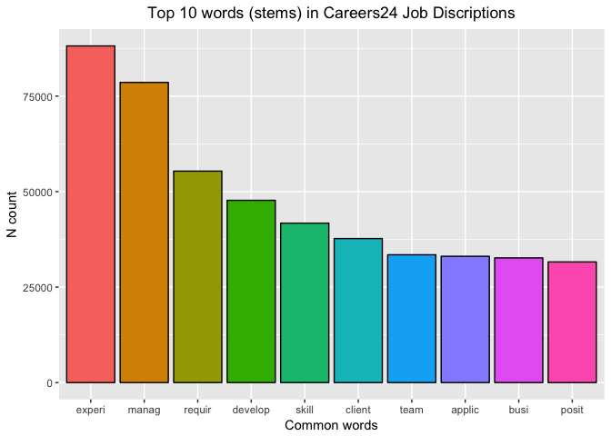
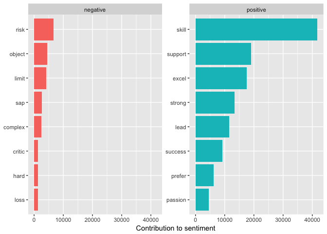
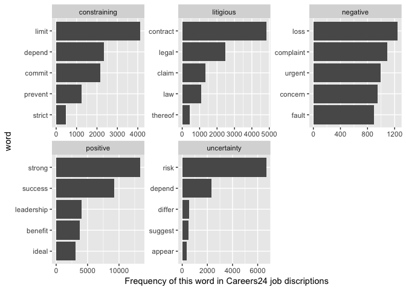

<style>
body {
text-align: justify}
</style>

# Introduction

This article serves as a basic introduction to text mining in R using the `tidytext` package. Specifically it looks as text mining job descriptions on [Careers24](http://www.careers24.com/), one of the leading job portals in South Africa.

Text mining usually involves the process of structuring the input text. The overarching goal is, essentially, to turn text into data for analysis, via application of natural language processing (NLP) and analytical methods.


Before we begin the analysis a close examination of the job descriptions shows that every description ends with the same two sentences (by default): "Companies may expire jobs at their own discretion. If you have not received a response within two weeks your application was most likely unsuccessful." One can remove these sentences by using the `gsub` fuction from the `tm` package.


```r
# Get rid of foreign symbols in job discriptions
careers24.data$job.description  <- gsub("Companies may expire jobs at their own discretion. If you have not received a response within two weeks, your application was most likely unsuccessful.", "", careers24.data$job.description )
```


# The Tidy Text 

The job descriptions on [Careers24](http://www.careers24.com/) are typical character vectors that we might want to analyse. In order to turn it into a tidy text dataset, we first need to put it into a data frame.

```r
text_df_career24 <- data_frame(line = 1:57837, text = careers24.data$job.description)
text_df_career24
```

```
## # A tibble: 57,837 x 2
##     line text                                                             
##    <int> <chr>                                                            
##  1     1 "Senior Enterprise Architect Leading consulting house looking fo~
##  2     2 A well established firm based in the East Rand is looking for SA~
##  3     3 A well established and dynamic firm based in the East Rand is lo~
##  4     4 "C# Developers needed  Centurion  Negotiable between R35k and R5~
##  5     5 "Senior C# needed  JHB  Negotiable between R500k and R720kJOB DE~
##  6     6 " To build relationships with clients To give objective professi~
##  7     7 "Would you like to become a Financial Adviser? Join our 2 year t~
##  8     8 "Guest RelationsTrainingDuty ManagementStaff Management Five sta~
##  9     9 Tired of waitressing?Tired of not making enough money and workin~
## 10    10 "five star hotel is seeking a Reservations agentRoom Reservation~
## # ... with 57,827 more rows
```

However, this data frame isn’t yet compatible with tidy text analysis. We can’t filter out words or count which occur most frequently, since each row is made up of multiple combined words. We need to convert this so that it has one-token-per-description-per-row. To do this, we use tidytext’s `unnest_tokens()` function.


```r
tidy_c24_job_discription <- text_df_career24 %>%
                            unnest_tokens(word, text, token = "words", to_lower = TRUE)

tidy_c24_job_discription
```

```
## # A tibble: 9,490,537 x 2
##     line word      
##    <int> <chr>     
##  1     1 senior    
##  2     1 enterprise
##  3     1 architect 
##  4     1 leading   
##  5     1 consulting
##  6     1 house     
##  7     1 looking   
##  8     1 for       
##  9     1 a         
## 10     1 senior    
## # ... with 9,490,527 more rows
```

Now that the data is in one-word-per-row format, we can manipulate it with tidy tools like `dplyr`. Often in text analysis, we will want to remove stop words; stop words are words that are not useful for an analysis, typically extremely common words such as “the”, “of”, “to”, and so forth in English. We can remove stop words (kept in the tidytext dataset `stop_words`) with an `anti_join()`. 


```r
tidy_c24_job_discription <- tidy_c24_job_discription %>%
                            anti_join(stop_words) %>%
                            filter(!word %in% text_df$word) %>%
                            mutate(word = SnowballC::wordStem(word))
```

```
## Joining, by = "word"
```
We can now use dplyr’s `count()` to find the most common words in all the job descriptions as a whole.

```r
tidy_c24_count <- tidy_c24_job_discription %>%
  count(word, sort = TRUE) 
tidy_c24_count
```

```
## # A tibble: 166,482 x 2
##    word        n
##    <chr>   <int>
##  1 experi  88138
##  2 manag   78586
##  3 requir  55365
##  4 develop 47719
##  5 skill   41740
##  6 client  37713
##  7 team    33465
##  8 applic  33065
##  9 busi    32644
## 10 posit   31590
## # ... with 166,472 more rows
```


```r
#top 10 words
ggplot(data=tidy_c24_count[1:10,],aes(x=word,y=n,fill=word))+
  geom_bar(colour="black",stat="identity")+
  xlab("Common words")+ylab("N count")+ggtitle("Careers24 Top 10 words in Job Discriptions")+
  guides(fill=FALSE)+theme(plot.title = element_text(hjust = 0.5))
```

<!-- -->

# Sentiment Analysis on Careers24 Job Discriptions

```r
bing_word_counts <- tidy_c24_job_discription %>%
  inner_join(get_sentiments("bing")) %>%
  count(word, sentiment, sort = TRUE) %>%
  ungroup()
```

```
## Joining, by = "word"
```

```r
bing_word_counts %>%
  group_by(sentiment) %>%
  top_n(8) %>%
  ungroup() %>%
  mutate(word = reorder(word, n)) %>%
  ggplot(aes(word, n, fill = sentiment)) +
  geom_col(show.legend = FALSE) +
  facet_wrap(~sentiment, scales = "free_y") +
  labs(y = "Contribution to sentiment",
       x = NULL) +
  coord_flip()
```

```
## Selecting by n
```

<!-- -->

```r
tidy_c24_job_discription %>%
  count(word) %>%
  inner_join(get_sentiments("loughran"), by = "word") %>%
  group_by(sentiment) %>%
  top_n(5, n) %>%
  ungroup() %>%
  mutate(word = reorder(word, n)) %>%
  ggplot(aes(word, n)) +
  geom_col() +
  coord_flip() +
  facet_wrap(~ sentiment, scales = "free") +
  ylab("Frequency of this word in Careers24 job discriptions")
```

<!-- -->


